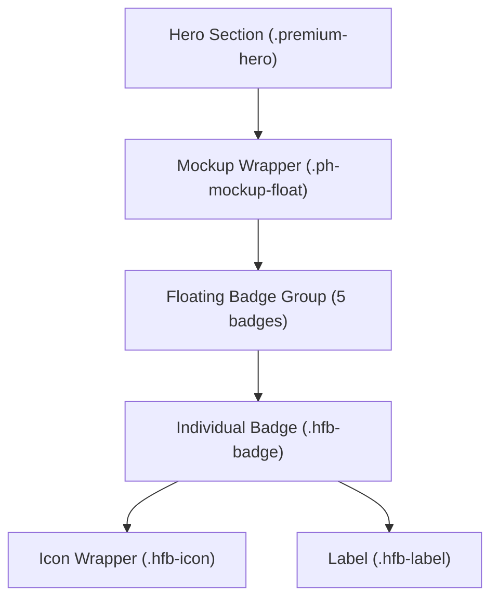
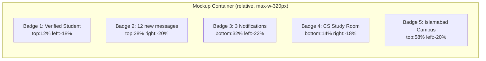

# Design Document: Hero Floating Badges

## Overview

Replace the CUICHAT landing page hero section's always-visible floating cards with a premium **hover-expand icon badge** pattern. Each badge renders as a compact circular icon in its default state and smoothly expands into a labeled pill on hover/focus, preserving the existing glassmorphism aesthetic and floating animations while adding a polished, interactive layer.

The change is purely presentational — only the hero floating card HTML and the associated CSS/JS inside `chatter_backend/resources/views/landing.blade.php` are modified. No routes, controllers, database models, admin panel, Flutter code, or other sections are touched.

---

## Architecture

### Component Hierarchy



### State Machine

```mermaid
stateDiagram-v2
    [*] --> Default: page load
    Default --> Expanded: mouseenter / focus-visible / touchstart
    Expanded --> Default: mouseleave / blur / touchend (outside)
    Default --> Default: floating animation continues
    Expanded --> Expanded: floating animation continues
```

### Layout Positioning



---

## Components and Interfaces

### Component: `.hfb-badge` (Floating Badge)

**Purpose**: The root element for each badge. Manages the expand/collapse transition and acts as the interactive target.

**Interface (HTML attributes)**:
```html
<div
  class="hfb-badge ph-float[N]"
  role="img"
  aria-label="[Full descriptive text]"
  title="[Full descriptive text]"
  tabindex="0"
  style="[absolute positioning]"
>
  <div class="hfb-icon"> ... </div>
  <span class="hfb-label">[Text]</span>
</div>
```

**Responsibilities**:
- Holds absolute positioning inherited from existing `.hero-glass-card` placement
- Triggers CSS hover/focus-visible state transitions
- Provides `aria-label` and `title` for screen readers and tooltips
- Accepts `tabindex="0"` for keyboard navigation

---

### Component: `.hfb-icon` (Icon Circle)

**Purpose**: The always-visible circular icon container. Defines the badge's collapsed size.

**Interface**:
```html
<div class="hfb-icon">
  <span class="material-symbols-outlined">[icon_name]</span>
</div>
```

**Responsibilities**:
- Fixed 40×40 px circle (the badge's minimum width/height)
- Holds the Material Symbol icon with per-badge accent color
- Stays visually stable during expand/collapse (no size change)

---

### Component: `.hfb-label` (Text Label)

**Purpose**: The text that appears on hover/focus. Hidden by default via opacity + translateX.

**Interface**:
```html
<span class="hfb-label">Verified Student</span>
```

**Responsibilities**:
- `opacity: 0` and `transform: translateX(-8px)` in default state
- Transitions to `opacity: 1` and `transform: translateX(0)` on parent hover/focus
- `white-space: nowrap` to prevent wrapping during animation
- `pointer-events: none` in collapsed state to avoid accidental hover capture

---

## Data Models

### Badge Definition

Each badge is a static data record embedded in the HTML. The five badges are:

| # | Label | Icon (Material Symbols) | Accent Color | Float Class | Position |
|---|-------|------------------------|--------------|-------------|----------|
| 1 | Verified Student | `verified` (FILL 1) | `#00fbfb` (cyan) | `ph-float` | `top:12%; left:-18%` |
| 2 | 12 new messages | `mark_chat_unread` | `#dfb7ff` (purple-light) | `ph-float-2` | `top:28%; right:-20%` |
| 3 | 3 Notifications | `notifications_active` (FILL 1) | `#ff6b6b` (red-soft) | `ph-float-3` | `bottom:32%; left:-22%` |
| 4 | CS Study Room | `menu_book` | `#00fbfb` (cyan) | `ph-float-4` | `bottom:14%; right:-18%` |
| 5 | Islamabad Campus | `location_on` (FILL 1) | `#b3c5ff` (blue-light) | `ph-float` | `top:58%; left:-20%` |

### Design Token Reference

```
--hfb-size:          40px          /* icon circle diameter */
--hfb-radius:        999px         /* pill border-radius */
--hfb-bg:            rgba(255,255,255,0.08)
--hfb-bg-hover:      rgba(255,255,255,0.14)
--hfb-border:        rgba(255,255,255,0.15)
--hfb-border-hover:  rgba(255,255,255,0.28)
--hfb-blur:          24px
--hfb-shadow:        0 8px 32px rgba(0,0,0,0.22)
--hfb-shadow-hover:  0 12px 40px rgba(0,0,0,0.35), 0 0 20px rgba(131,51,198,0.25)
--hfb-transition:    width .35s ease, transform .35s ease,
                     box-shadow .35s ease, background .35s ease
--hfb-label-gap:     10px          /* gap between icon and label */
--hfb-padding-h:     10px          /* horizontal padding inside pill */
```

---

## Algorithmic Pseudocode

### Badge Expand/Collapse Algorithm (CSS-driven)

```pascal
ALGORITHM BadgeInteraction(badge)
INPUT: badge — DOM element with class .hfb-badge
OUTPUT: visual state change (CSS transition)

BEGIN
  // Default state — icon only
  badge.width ← 40px
  badge.padding ← 5px
  badge.label.opacity ← 0
  badge.label.transform ← translateX(-8px)
  badge.label.pointerEvents ← none

  ON (mouseenter OR focus-visible) DO
    badge.width ← fit-content   // CSS: width auto, max-width capped
    badge.padding ← 5px 14px 5px 5px
    badge.background ← --hfb-bg-hover
    badge.boxShadow ← --hfb-shadow-hover
    badge.transform ← translateY(-3px)
    badge.label.opacity ← 1
    badge.label.transform ← translateX(0)
    badge.label.pointerEvents ← auto
    // All changes driven by CSS transition: .35s ease
  END ON

  ON (mouseleave OR blur) DO
    // Reverse all hover state changes
    // CSS transition handles animation back to default
  END ON
END
```

### Mobile Tap Toggle Algorithm (JavaScript)

```pascal
ALGORITHM MobileTapToggle
INPUT: tap event on .hfb-badge
OUTPUT: toggle .hfb-expanded class

BEGIN
  ON document.ready DO
    FOR each badge IN querySelectorAll('.hfb-badge') DO
      badge.addEventListener('touchstart', handleTap, {passive: true})
    END FOR
    document.addEventListener('touchstart', handleOutsideTap, {passive: true})
  END ON

  PROCEDURE handleTap(event)
    event.stopPropagation()
    activeBadge ← event.currentTarget

    IF activeBadge.classList.contains('hfb-expanded') THEN
      activeBadge.classList.remove('hfb-expanded')
    ELSE
      // Collapse any other open badge
      FOR each other IN querySelectorAll('.hfb-badge.hfb-expanded') DO
        other.classList.remove('hfb-expanded')
      END FOR
      activeBadge.classList.add('hfb-expanded')
    END IF
  END PROCEDURE

  PROCEDURE handleOutsideTap(event)
    IF event.target does NOT match '.hfb-badge' AND
       event.target does NOT match '.hfb-badge *' THEN
      FOR each badge IN querySelectorAll('.hfb-badge.hfb-expanded') DO
        badge.classList.remove('hfb-expanded')
      END FOR
    END IF
  END PROCEDURE
END
```

---

## Key Functions with Formal Specifications

### CSS Rule: `.hfb-badge` (default state)

```css
.hfb-badge {
  /* sizing */
  width: 40px;
  height: 40px;
  padding: 5px;
  overflow: hidden;
  /* layout */
  display: inline-flex;
  align-items: center;
  flex-wrap: nowrap;
  gap: 10px;
  /* glass */
  background: rgba(255,255,255,0.08);
  backdrop-filter: blur(24px);
  -webkit-backdrop-filter: blur(24px);
  border: 1px solid rgba(255,255,255,0.15);
  box-shadow: 0 8px 32px rgba(0,0,0,0.22);
  border-radius: 999px;
  /* animation */
  transition: width .35s ease, height .35s ease,
              padding .35s ease, transform .35s ease,
              box-shadow .35s ease, background .35s ease,
              border-color .35s ease;
  /* positioning */
  position: absolute;
  white-space: nowrap;
  cursor: default;
  /* font */
  color: #fff;
  font-size: 13px;
  font-weight: 600;
  font-family: 'Manrope', sans-serif;
}
```

**Preconditions:**
- Parent container has `position: relative`
- Badge is positioned via inline `style` attribute (top/left/right/bottom percentages)
- Material Symbols font is loaded

**Postconditions:**
- Badge renders as a 40×40 px circle
- Label is visually hidden (overflow: hidden clips it)
- Floating animation from parent `ph-float*` class is active

---

### CSS Rule: `.hfb-badge:hover, .hfb-badge:focus-visible, .hfb-badge.hfb-expanded` (expanded state)

```css
.hfb-badge:hover,
.hfb-badge:focus-visible,
.hfb-badge.hfb-expanded {
  width: auto;
  max-width: 220px;
  height: 40px;
  padding: 5px 14px 5px 5px;
  background: rgba(255,255,255,0.14);
  border-color: rgba(255,255,255,0.28);
  box-shadow: 0 12px 40px rgba(0,0,0,0.35),
              0 0 20px rgba(131,51,198,0.25);
  transform: translateY(-3px);
  outline: none;
}
```

**Preconditions:**
- Badge is in default (collapsed) state
- User triggers hover, keyboard focus, or `.hfb-expanded` class is added via JS

**Postconditions:**
- Badge width expands to fit label text (max 220px)
- Label becomes visible via `.hfb-label` transition
- Badge lifts 3px via `translateY(-3px)`
- Glow shadow intensifies

---

### CSS Rule: `.hfb-label` (default + expanded)

```css
/* Default: hidden */
.hfb-label {
  opacity: 0;
  transform: translateX(-8px);
  transition: opacity .3s ease .05s, transform .3s ease .05s;
  pointer-events: none;
  white-space: nowrap;
  flex-shrink: 0;
}

/* Expanded: visible */
.hfb-badge:hover .hfb-label,
.hfb-badge:focus-visible .hfb-label,
.hfb-badge.hfb-expanded .hfb-label {
  opacity: 1;
  transform: translateX(0);
  pointer-events: auto;
}
```

**Preconditions:**
- `.hfb-label` is a direct child of `.hfb-badge`
- Parent badge overflow is `hidden` in collapsed state

**Postconditions:**
- Label slides in from left (`translateX(-8px → 0)`) with slight delay (0.05s) for staggered feel
- Label fades in simultaneously
- No layout reflow — label is always in the DOM, just visually hidden

---

### CSS Rule: `.hfb-icon` (icon circle)

```css
.hfb-icon {
  width: 30px;
  height: 30px;
  border-radius: 50%;
  display: flex;
  align-items: center;
  justify-content: center;
  flex-shrink: 0;
  /* background set per-badge via inline style */
}
.hfb-icon .material-symbols-outlined {
  font-size: 17px;
  line-height: 1;
}
```

**Preconditions:**
- Icon name is a valid Material Symbols identifier
- Per-badge accent color applied via inline `style` on `.hfb-icon`

**Postconditions:**
- Icon circle is always visible regardless of badge state
- Icon does not resize or shift during expand/collapse

---

## Example Usage

### Badge 1 — Verified Student

```html
<div class="hfb-badge ph-float z-20"
     role="img"
     aria-label="Verified Student"
     title="Verified Student"
     tabindex="0"
     style="top:12%;left:-18%;animation-delay:0s;">
  <div class="hfb-icon"
       style="background:rgba(0,251,251,0.18);border:1px solid rgba(0,251,251,0.30);">
    <span class="material-symbols-outlined"
          style="color:#00fbfb;font-variation-settings:'FILL' 1;">verified</span>
  </div>
  <span class="hfb-label">Verified Student</span>
</div>
```

### Badge 2 — 12 new messages

```html
<div class="hfb-badge ph-float-2 z-20"
     role="img"
     aria-label="12 new messages"
     title="12 new messages"
     tabindex="0"
     style="top:28%;right:-20%;animation-delay:1.5s;">
  <div class="hfb-icon"
       style="background:rgba(131,51,198,0.28);border:1px solid rgba(131,51,198,0.40);">
    <span class="material-symbols-outlined"
          style="color:#dfb7ff;">mark_chat_unread</span>
  </div>
  <span class="hfb-label">12 new messages</span>
</div>
```

### Badge 3 — 3 Notifications

```html
<div class="hfb-badge ph-float-3 z-20"
     role="img"
     aria-label="3 Notifications"
     title="3 Notifications"
     tabindex="0"
     style="bottom:32%;left:-22%;animation-delay:0.8s;">
  <div class="hfb-icon"
       style="background:rgba(186,26,26,0.28);border:1px solid rgba(186,26,26,0.40);">
    <span class="material-symbols-outlined"
          style="color:#ff6b6b;font-variation-settings:'FILL' 1;">notifications_active</span>
  </div>
  <span class="hfb-label">3 Notifications</span>
</div>
```

### Badge 4 — CS Study Room

```html
<div class="hfb-badge ph-float-4 z-20"
     role="img"
     aria-label="CS Study Room"
     title="CS Study Room"
     tabindex="0"
     style="bottom:14%;right:-18%;animation-delay:2.2s;">
  <div class="hfb-icon"
       style="background:rgba(0,251,251,0.22);border:1px solid rgba(0,251,251,0.30);">
    <span class="material-symbols-outlined"
          style="color:#00fbfb;">menu_book</span>
  </div>
  <span class="hfb-label">CS Study Room</span>
</div>
```

### Badge 5 — Islamabad Campus

```html
<div class="hfb-badge ph-float z-20"
     role="img"
     aria-label="Islamabad Campus"
     title="Islamabad Campus"
     tabindex="0"
     style="top:58%;left:-20%;animation-delay:3s;">
  <div class="hfb-icon"
       style="background:rgba(67,91,159,0.30);border:1px solid rgba(67,91,159,0.45);">
    <span class="material-symbols-outlined"
          style="color:#b3c5ff;font-variation-settings:'FILL' 1;">location_on</span>
  </div>
  <span class="hfb-label">Islamabad Campus</span>
</div>
```

---

## Correctness Properties

1. **Icon always visible**: For all badges in any state, the `.hfb-icon` element is always rendered with `width: 30px; height: 30px` and is never clipped.

2. **No layout jump**: The badge uses `overflow: hidden` + `width` transition rather than `display` toggling, so no surrounding elements reflow during expand/collapse.

3. **Label never wraps**: `white-space: nowrap` on `.hfb-label` guarantees single-line text at all viewport widths.

4. **Floating animation preserved**: The `ph-float`, `ph-float-2`, `ph-float-3`, `ph-float-4` keyframe animations are applied to the badge element itself; the hover `translateY(-3px)` is additive via CSS `transform` on the same element — both coexist without conflict because the float animation uses `translateY` and the hover adds to it via the transition property.

   > **Note**: Because both the float animation and hover use `transform`, the hover `translateY(-3px)` will override the animation's transform during hover. The float animation pauses visually on hover, which is acceptable and common in premium UI patterns. If simultaneous animation is required, the float should be applied to a wrapper element instead.

5. **Mobile no-overflow**: On viewports ≤ 768px, badges are hidden via `display: none` (inherited from existing `@media(max-width:768px) .hero-glass-card{display:none;}` — the new `.hfb-badge` class replaces `.hero-glass-card` and inherits this rule).

6. **Keyboard accessible**: `tabindex="0"` + `:focus-visible` CSS selector ensures keyboard users get the same expanded state as mouse users, without showing focus rings on mouse click (`:focus-visible` vs `:focus`).

7. **Accessibility label completeness**: Every badge has both `aria-label` (for screen readers) and `title` (for tooltip on hover), containing the full human-readable text.

---

## Error Handling

### Scenario 1: Material Symbols font fails to load

**Condition**: Google Fonts CDN is unavailable.
**Response**: Icon `<span>` renders as text fallback (the icon name string). Badge circle still renders correctly.
**Recovery**: No action needed — the badge shape and label remain functional. Consider adding a local font fallback in a future iteration.

### Scenario 2: Badge overflows viewport on small screens

**Condition**: On narrow screens (320–375px), badges positioned at `left:-18%` or `right:-20%` may clip outside the viewport.
**Response**: Existing `@media(max-width:768px) { .hero-glass-card { display:none; } }` hides all badges on mobile — this rule is updated to target `.hfb-badge` instead.
**Recovery**: Badges are fully hidden on mobile; no overflow occurs.

### Scenario 3: Touch device — hover state never triggers

**Condition**: Touch-only devices do not fire `mouseenter`/`mouseleave`.
**Response**: JavaScript `touchstart` handler adds/removes `.hfb-expanded` class to simulate the hover expand.
**Recovery**: Single tap expands; tap outside or second tap collapses. Focus-visible also works for keyboard/switch access.

### Scenario 4: `prefers-reduced-motion` is set

**Condition**: User has enabled reduced motion in OS settings.
**Response**: Existing `@media(prefers-reduced-motion:reduce)` rule disables `ph-float*` animations. The badge expand/collapse CSS transitions should also be disabled.
**Recovery**: Add to the reduced-motion block: `.hfb-badge { transition: none; } .hfb-label { transition: none; }` — badges still expand on hover, just without animation.

---

## Testing Strategy

### Unit Testing Approach

Since this is a pure HTML/CSS/JS change in a Blade template, unit tests are not applicable in the traditional sense. Visual regression and manual interaction testing are the primary verification methods.

**Manual test checklist**:
- [ ] Each badge renders as a circle (icon only) on page load
- [ ] Hovering each badge expands it to show the label
- [ ] Label slides in from left with opacity fade
- [ ] Badge lifts on hover (`translateY(-3px)`)
- [ ] Mouse-out collapses badge smoothly
- [ ] Tab key cycles through all 5 badges
- [ ] Focus-visible state expands badge (same as hover)
- [ ] Blur collapses badge
- [ ] `aria-label` and `title` are present on each badge (inspect DOM)

### Property-Based Testing Approach

Not applicable for CSS/HTML-only changes. If JavaScript logic is extracted to a module, property tests could verify:
- `handleTap` always results in exactly 0 or 1 badge having `.hfb-expanded` at any time
- `handleOutsideTap` always removes `.hfb-expanded` from all badges

### Integration Testing Approach

**Browser compatibility matrix**:
- Chrome 90+ (backdrop-filter supported)
- Firefox 103+ (backdrop-filter supported)
- Safari 14+ (webkit-backdrop-filter supported)
- Edge 90+

**Responsive breakpoints to test**:
- 320px — badges hidden (mobile)
- 768px — badges hidden (tablet boundary)
- 769px+ — badges visible, hover works
- 1280px+ — full desktop layout

---

## Performance Considerations

- **CSS transitions only** for expand/collapse — no JavaScript animation loops, no `requestAnimationFrame`.
- **`will-change` not added** — the badges are small elements; adding `will-change: width, transform` could be considered if jank is observed on low-end devices.
- **`backdrop-filter`** is GPU-accelerated in modern browsers. Five simultaneous blurred elements are within acceptable limits for the hero section.
- **No new network requests** — all icons use the already-loaded Material Symbols font; no new images or scripts are added.

---

## Security Considerations

- No user input is rendered in badge labels — all text is static, hardcoded strings. No XSS risk.
- No new JavaScript event listeners that could be exploited; the touch handler only toggles a CSS class.
- No new external dependencies introduced.

---

## Dependencies

| Dependency | Already Present | Purpose |
|---|---|---|
| Material Symbols Outlined (Google Fonts) | ✅ Yes | Badge icons |
| Tailwind CSS (CDN) | ✅ Yes | Utility classes (`z-20`, etc.) |
| Manrope font (Google Fonts) | ✅ Yes | Badge label typography |
| Vanilla JavaScript | ✅ Yes (inline) | Mobile tap toggle |

No new dependencies are required.
