# POS Backers - Point of Sale System

A comprehensive Point of Sale (POS) mobile application built with Flutter, designed for retail businesses with offline-first architecture, real-time sync, and advanced inventory management.

## 🚀 Features

### Core Functionality
- **Sales Management**: Fast and intuitive billing interface with barcode scanning
- **Inventory Control**: Real-time stock tracking with low stock alerts
- **Customer Management**: Walk-in and regular customer profiles with purchase history
- **Product Catalog**: Comprehensive product management with categories and pricing
- **Tax Configuration**: Multiple tax rules with inclusive/exclusive calculation modes
- **Discount System**: Percentage and fixed amount discounts per transaction
- **Payment Methods**: Support for cash, card, and online payments

### Advanced Features
- **Offline-First**: Fully functional without internet connectivity
- **Real-time Sync**: Automatic synchronization with Supabase backend
- **Receipt Generation**: PDF receipts with printing and sharing capabilities
- **Multi-Currency**: Configurable currency support
- **Sales Reports**: Comprehensive analytics and reporting dashboard
- **Stock Operations**: Track stock additions, adjustments, and inventory movements
- **Backup & Restore**: Local and cloud backup options
- **Pull-to-Refresh**: Refresh customer data on demand

## 📋 Prerequisites

- Flutter SDK (3.9.2 or higher)
- Dart SDK (3.9.2 or higher)
- Android Studio / VS Code with Flutter extensions
- Supabase account (for backend services)
- Firebase account (for Google authentication)

## 🛠️ Installation

### 1. Clone the Repository
```bash
git clone https://github.com/YOUR_USERNAME/pos_backers.git
cd pos_backers
```

### 2. Install Dependencies
```bash
flutter pub get
```

### 3. Configure Environment Variables
Create a `.env` file in the project root:
```env
SUPABASE_URL=your_supabase_project_url
SUPABASE_ANON_KEY=your_supabase_anon_key
```

### 4. Setup Supabase Backend
1. Create a new Supabase project
2. Run the SQL script from `SUPABASE_SETUP.sql` in the SQL editor
3. Enable authentication providers (Email, Google)
4. Configure Row Level Security (RLS) policies

### 5. Configure Firebase (Optional)
1. Add `google-services.json` to `android/app/`
2. Follow the Firebase setup guide in `GOOGLE_DRIVE_SETUP.md`

### 6. Run the Application
```bash
flutter run
```

## 📱 Building for Production

### Android APK
```bash
flutter build apk --release
```
Output: `build/app/outputs/flutter-apk/app-release.apk`

### Android App Bundle
```bash
flutter build appbundle --release
```
Output: `build/app/outputs/bundle/release/app-release.aab`

## 🏗️ Architecture

### Tech Stack
- **Framework**: Flutter 3.9.2
- **Language**: Dart
- **State Management**: StatefulWidget with setState
- **Local Database**: SQLite (sqflite)
- **Backend**: Supabase (PostgreSQL)
- **Authentication**: Supabase Auth + Google Sign-In
- **Local Storage**: SharedPreferences, Hive
- **Networking**: Connectivity Plus for offline detection

### Project Structure
```
lib/
├── core/
│   ├── services/          # Business logic and data services
│   │   ├── connectivity_service.dart
│   │   ├── local_database_service.dart
│   │   ├── supabase_service.dart
│   │   ├── settings_service.dart
│   │   └── offline_queue_service.dart
│   └── theme/             # App theming and colors
│       └── app_theme.dart
├── screens/               # UI screens
│   ├── splash_screen.dart
│   ├── login_screen.dart
│   ├── dashboard_screen.dart
│   ├── pos_screen.dart
│   ├── pos_payment_screen.dart
│   ├── products_screen.dart
│   ├── customers_screen.dart
│   ├── inventory_screen.dart
│   ├── reports_screen.dart
│   ├── settings_screen.dart
│   └── tax_configuration_screen.dart
├── widgets/               # Reusable components
│   └── offline_banner.dart
└── main.dart             # Application entry point
```

### Database Schema
#### Local SQLite Tables
- `products`: Product catalog with prices and stock
- `customers`: Customer information and profiles
- `sales`: Transaction records with items and totals
- `stock_operations`: Inventory movement history
- `offline_queue`: Pending sync operations

#### Supabase Tables
- `products`: Synced product data
- `customers`: Synced customer data
- `sales`: Synced sales records
- `stock_operations`: Synced inventory operations

## 🔧 Configuration

### Tax Settings
Navigate to **Settings > Tax Configuration** to:
- Enable/disable tax system
- Choose inclusive or exclusive tax mode
- Add multiple tax rules with custom rates
- Activate/deactivate specific tax rules
- Edit or delete existing tax rules

### Currency Settings
Navigate to **Settings > Currency** to select your preferred currency symbol.

### Backup Settings
Navigate to **Settings > Backup & Restore** to:
- Export data to JSON
- Import data from backup files
- Configure Google Drive sync (optional)

## 📊 Usage Guide

### Making a Sale
1. Navigate to **POS Screen**
2. Select customer (walk-in or regular)
3. Add products by scanning barcode or manual selection
4. Apply discounts or taxes if needed
5. Click **Checkout** to proceed to payment
6. Select payment method and confirm
7. Generate and share receipt

### Managing Inventory
1. Navigate to **Inventory** from dashboard
2. View real-time stock levels
3. Track stock operations history
4. Add stock through **Stock Operations**

### Viewing Reports
1. Navigate to **Reports** from dashboard
2. View sales analytics and trends
3. Filter by date range
4. Export reports for analysis

## 🔐 Security

- Row Level Security (RLS) enabled on Supabase tables
- User-specific data isolation
- Secure authentication with JWT tokens
- Local data encryption with SQLite

## 🤝 Contributing

Contributions are welcome! Please follow these steps:
1. Fork the repository
2. Create a feature branch (`git checkout -b feature/AmazingFeature`)
3. Commit your changes (`git commit -m 'Add some AmazingFeature'`)
4. Push to the branch (`git push origin feature/AmazingFeature`)
5. Open a Pull Request

## 📝 License

This project is licensed under the MIT License - see the LICENSE file for details.

## 📧 Support

For support and queries:
- Email: support@posbackers.com
- Issues: [GitHub Issues](https://github.com/YOUR_USERNAME/pos_backers/issues)

## 🙏 Acknowledgments

- Flutter and Dart teams for the amazing framework
- Supabase for the backend infrastructure
- All contributors and testers

---

## 📸 Screenshots

Below are key screens of the application. Add the PNG files to `assets/screenshots/` with the exact filenames shown below.

- Backup & Restore – Select Backup dialog  
	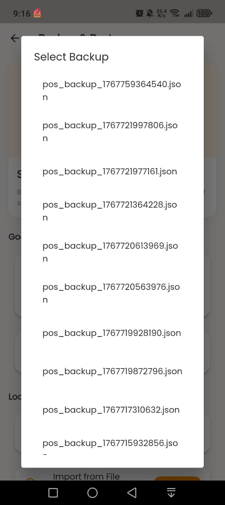

- Backup & Restore – Restore from Google Drive success  
	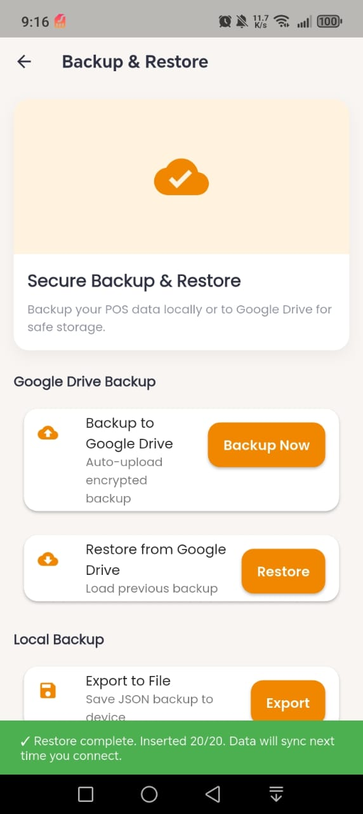

- Appearance – Theme selection (Dark Mode)  
	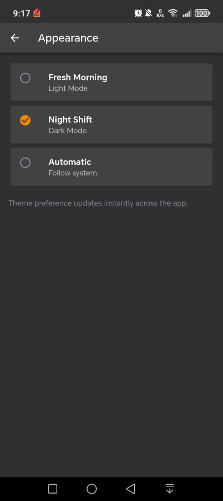

- About – App version and links  
	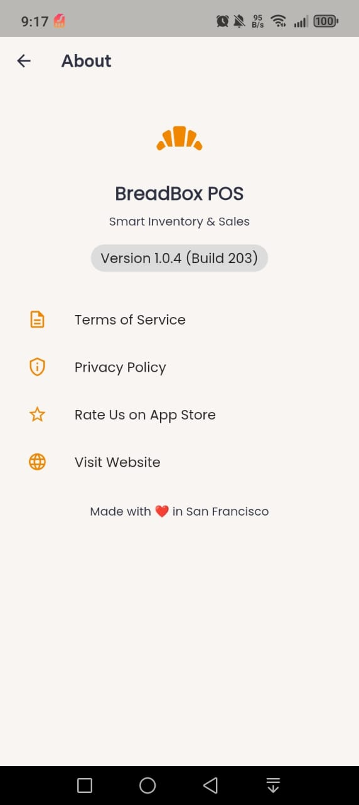

- Backup & Restore – Export to File confirmation toast  
	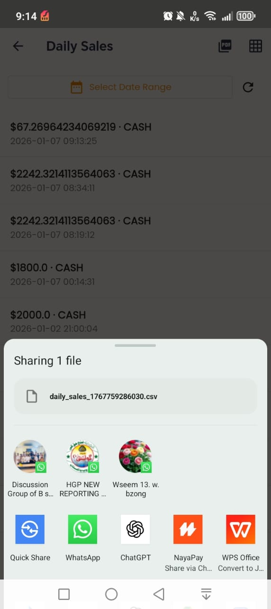

- Dashboard – Overview and best sellers  
	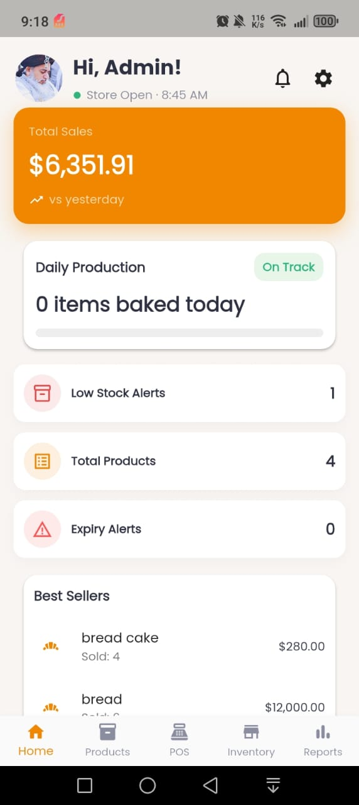

- Edit Profile – Business information  
	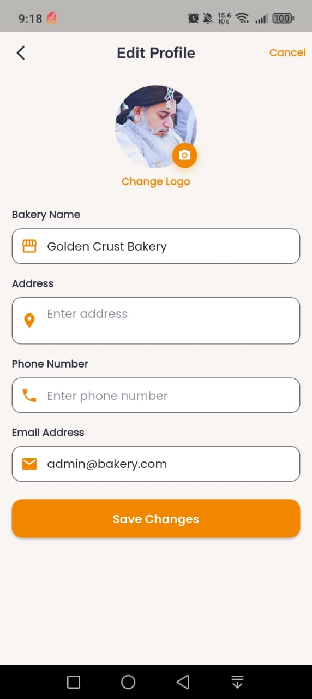

- Login – Supabase and SQLite (Offline) options  
	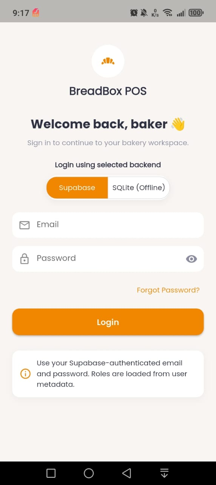

- Products – List with search and add product  
	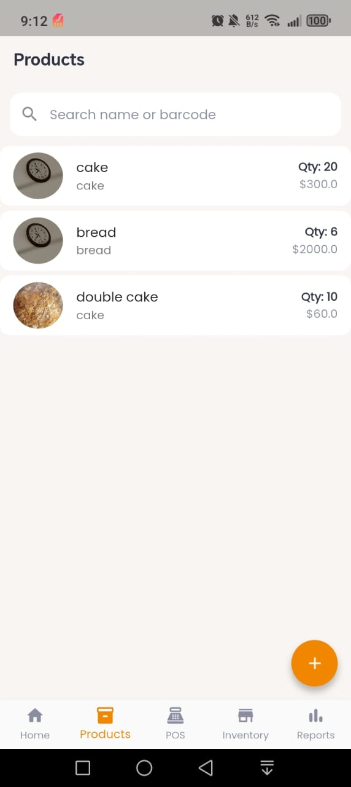

- POS Billing – Cart, customer, tax, discount, and checkout  
	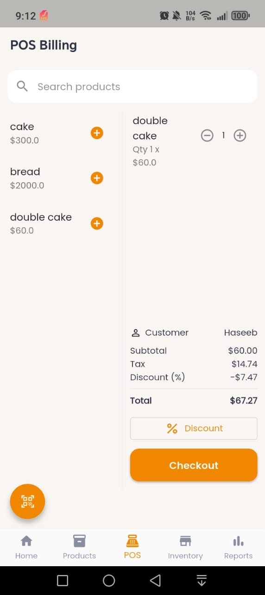

- Settings – App settings hub  
	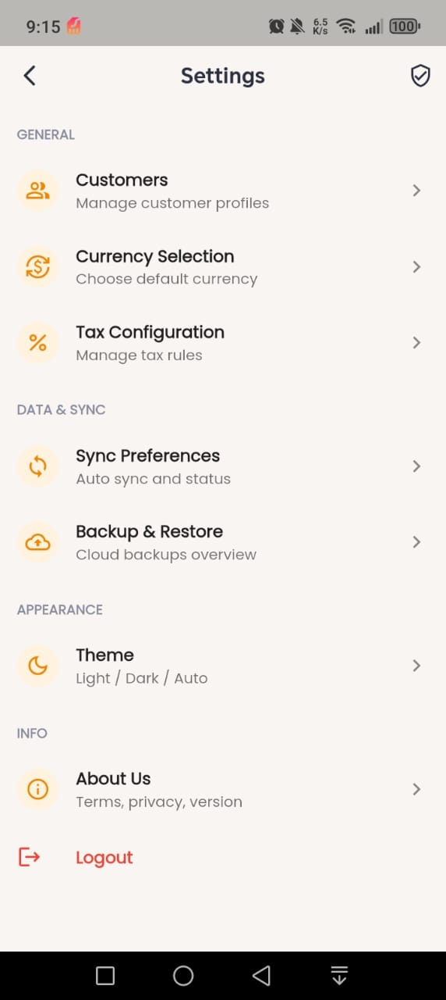

- Sync Preferences – Online/offline backend selection and sync options  
	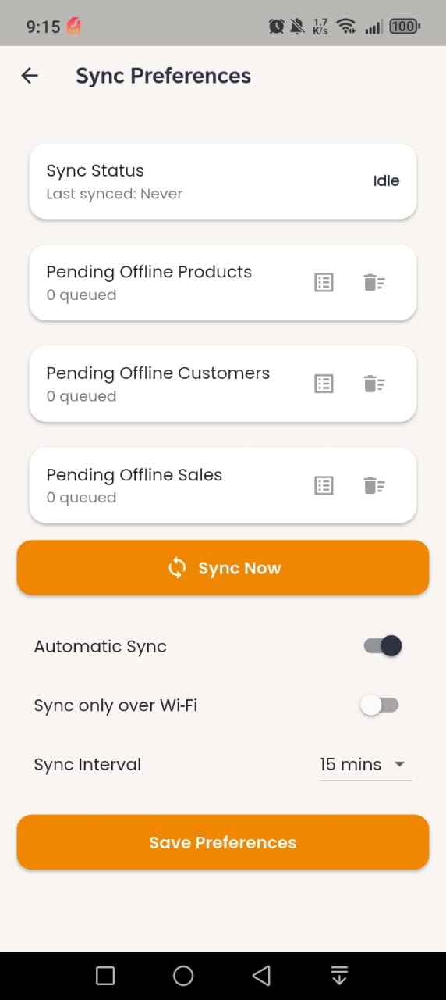

- Inventory – Stock overview and adjustments  
	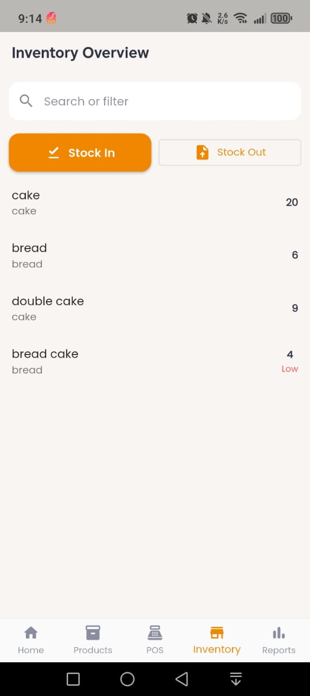

- Reports – Sales analytics and summaries  
	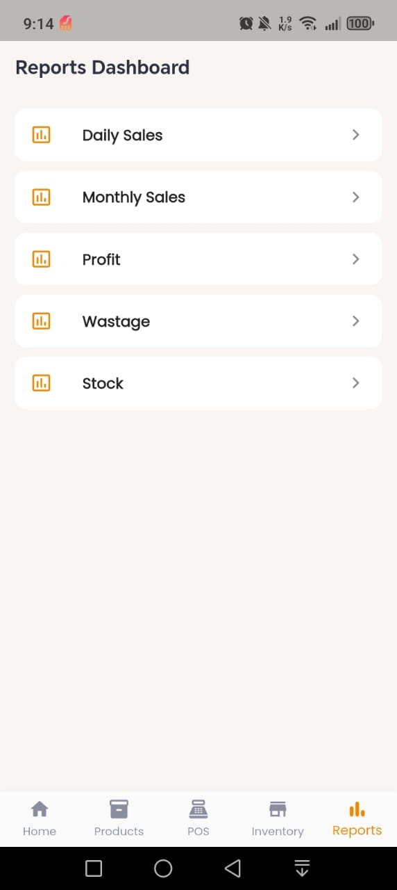

### How to add your screenshots
1. Save each screenshot image (PNG recommended) to `assets/screenshots/` using the filenames above.
2. Commit and push the images to your repository.
3. Markdown will automatically render them in this README.

---

**Version**: 1.0.4  
**Last Updated**: January 2026  
**Developed with ❤️ using Flutter**
